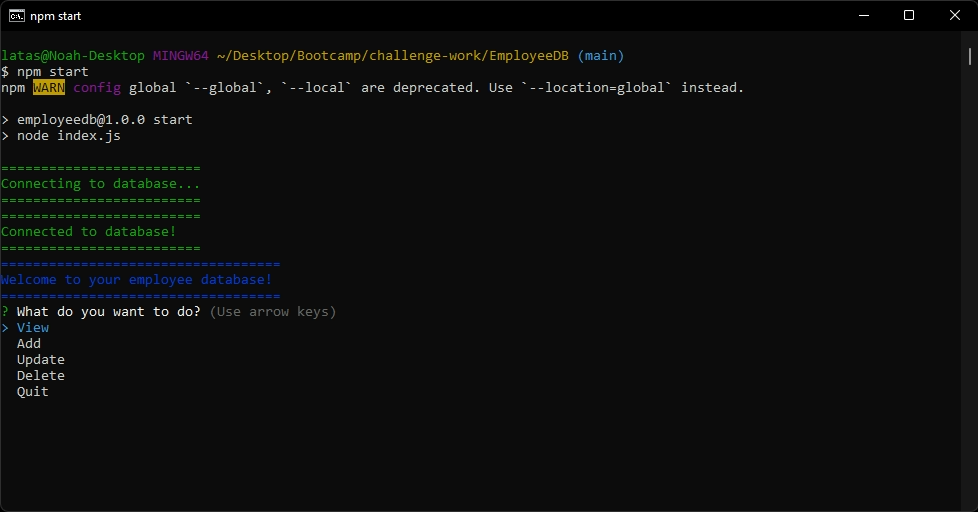

# EmployeeDB

## Description

This project is a content management system to manage a database of departments, roles, and employees for a company with the options to view, add, update, and delete the various departments, roles, and employees.

I learned a great deal about working with a mySQL database during this project, especially with the proper syntax for making various queries to a database and its tables. I also improved my skills and knowledge in building classes in JavaScript.

## Table of Contents

- [Installation](#installation)
- [Usage](#usage)
- [Credits](#credits)
- [License](#license)
- [Questions](#questions)

## Installation

If you do not have Node.js installed, first go to the [Node.js website](https://nodejs.org/en/) and follow the instructions to install Node.js. Once you have Node.js Installed or if you already had it on your machine use git to clone the project repository from GitHub. After cloning, run 'npm i' or 'npm install' from the command line in the directory of the project to install all neccessary dependencies for this project. Use the schema file found in the db directory to create the database and optionally the seeds file to seed the database with examples. Rename the .env.EXAMPLE file by removing the .EXAMPLE from the name and fill out the enviroment variables contained within the file. Now you are good to go!

## Usage

After installation, navigate to the main directory of this project using your terminal. Then run 'npm start' or 'node index.js' to start the app. Use the up and down arrow keys to select between different options and use the enter key to make your selection. When given a checkbox type prompt, such as with the update a role or employee option, use the spacebar to make your various selections, again using the up and down arrow key to navigate. Once ready use the enter key to confirm your selections. Use the 'Back to Main Menu' option to go back to the main menu. Use the 'Quit' option to quit the app when you are done.

Watch the walkthrough demo below by following the link.

[EmployeeDB walkthrough demo video](https://drive.google.com/file/d/1P4xkeSkHrDZ2C4kZRzpi4WTsVKNovUBa/view?usp=sharing)

## Credits

#### Third-Party Assets

- [Node.js](https://nodejs.org/en/)
- [mySQL](https://www.mysql.com/)
- [Inquirer](https://github.com/SBoudrias/Inquirer.js)
- [Chalk](https://github.com/chalk/chalk)
- [console.table](https://github.com/bahmutov/console.table)
- [mySQL2](https://github.com/sidorares/node-mysql2)
- [dotenv](https://github.com/motdotla/dotenv)

## License

This project is not licensed.

## Questions

You can find me here:

- GitHub: [PierTwo](https://github.com/PierTwo)
- Email: <latasnoah@gmail.com>
